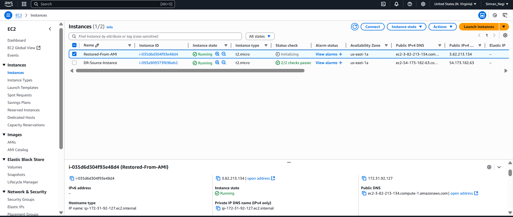
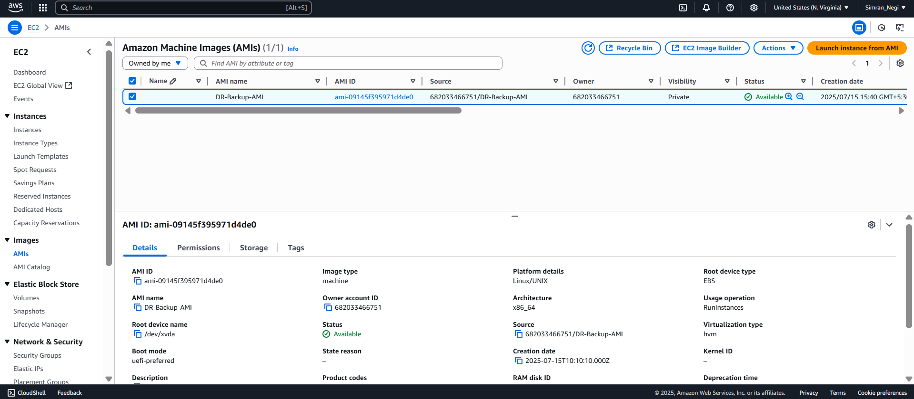
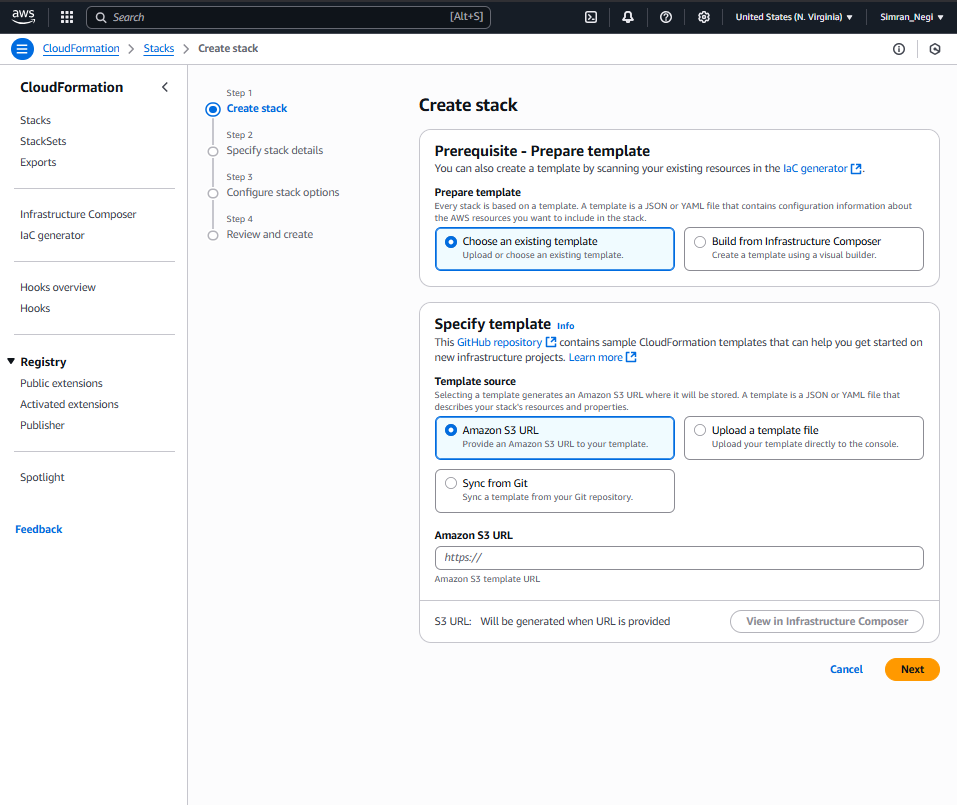
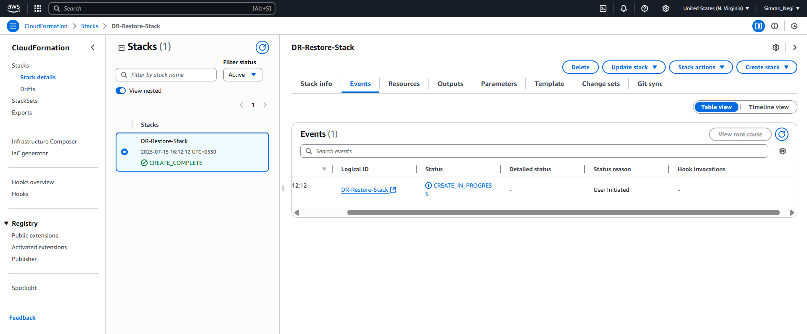
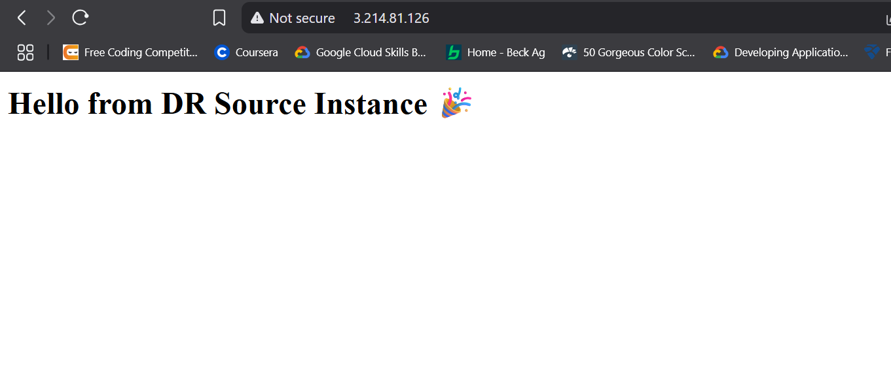
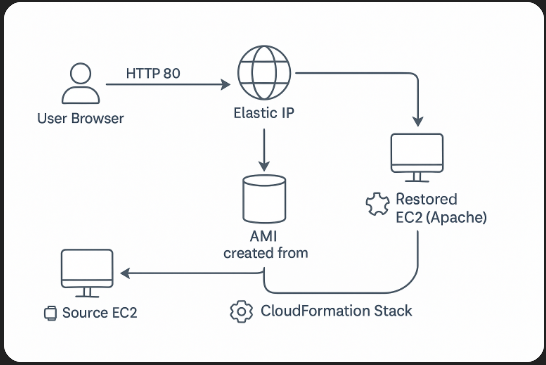

<!--
###############################################################
#            DISASTER RECOVERY SYSTEM ON AWS – README          #
###############################################################
-->

<h1 align="center">🚨  Disaster Recovery System on AWS  🚨</h1>
<p align="center">
  <i>“Because zero‑downtime is the best uptime.”</i><br>
  <a href="http://3.214.81.126/" target="_blank">🌐&nbsp;Live Demo</a>  •  <a href="#-architecture">🖼 Architecture Diagram</a>   •   <a href="https://simran-n17.github.io/Disaster-Recovery-AWS/">🖼 Index.html</a>
</p>

---

## 📑 Table&nbsp;of&nbsp;Contents
1. [Project Goal](#-project-goal)
2. [Why Disaster Recovery?](#-why-disaster-recovery)
3. [Key Concepts & AWS Services](#-key-concepts--aws-services)
4. [Step‑by‑Step Implementation](#-step-by-step-implementation)
5. [Challenges & Fixes](#-challenges--fixes)
6. [Screenshots / Demo](#-screenshots--demo)
7. [Run It Yourself](#-run-it-yourself)
8. [Future Work](#-future-work)
9. [License & Author](#-license--author)

---

## 🎯 Project Goal
Create an **automated, one‑click Disaster Recovery (DR) workflow** that can:
1. 🔒 **Back up** a production EC2 instance (code + config) as an AMI snapshot.  
2. ⚙️ **Rebuild** the entire server stack via **Infrastructure‑as‑Code** (CloudFormation) in under two minutes.  
3. 🌐 Restore web‑service availability with **zero manual configuration**.

---

## ❓ Why Disaster Recovery?
- **Business Continuity:** Hardware failure, accidental deletion, or a security incident shouldn’t take services offline.
- **Cost Efficiency:** Snapshots/AMIs are pay‑as‑you‑go; you avoid idle standby servers.
- **Automation > Documentation:** IaC guarantees the restore procedure is always up‑to‑date and repeatable.

---

## 🛠 Key Concepts & AWS Services
| Concept / Service | Role in the Project |
|-------------------|---------------------|
| **EC2**           | Hosts the web application (Apache demo). |
| **AMI + Snapshot**| Immutable backup of the instance’s OS, packages, data. |
| **CloudFormation**| Declarative template that rebuilds EC2 from the AMI, attaches SG, key pair, Elastic IP. |
| **Elastic IP**    | Static IP so the demo link never changes. |
| **Security Groups**| Firewall rules (HTTP 80, SSH 22). |
| **IAM**           | Least‑privilege roles for CloudFormation and (optionally) Lambda. |
| *(Optional)* **S3** | Store logs or backup metadata for audit. |
| *(Optional)* **Lambda + EventBridge* | Schedule nightly AMI creation for continuous backups. |

---

## 🛠️ Step‑by‑Step Implementation
<details>
<summary>Click to expand the build log</summary>

### 1. Launch & Configure Source EC2
```bash
# Amazon Linux 2023
sudo yum update -y
sudo yum install httpd -y
echo "Hello from DR Source Instance 🎉" | sudo tee /var/www/html/index.html
sudo systemctl enable --now httpd
````

### 2. Create a Gold AMI

EC2 Console → *Actions › Image › Create Image* → Name `dr-backup-<date>` → wait till **AMI\_ID** is `available`.

### 3. Write `dr-restore.yaml`

```yaml
Resources:
  RestoredInstance:
    Type: AWS::EC2::Instance
    Properties:
      ImageId: ami-xxxxxxxxxxxx   # <-- AMI_ID
      InstanceType: t3.micro
      KeyName: KeyPair
      SecurityGroupIds: [sg-xxxxxxxxxxxx]
      Tags: [{Key: Name, Value: RestoredInstance}]
Outputs:
  URL: {Value: !Sub "http://${RestoredInstance.PublicIp}"}
```

### 4. One‑Click Restore

```bash
aws cloudformation create-stack \
  --stack-name DR-Restore \
  --template-body file://dr-restore.yaml
```

### 5. Verify

Visit `http://<Restored_Public_IP>` → should render **Hello from DR Source Instance 🎉**
Terminate the source instance to simulate a disaster; the restored one carries on serving traffic.

</details>

---

## 🐉 Challenges & Fixes

| Challenge                                | Fix / Learning                                                                |
| ---------------------------------------- | ----------------------------------------------------------------------------- |
| **Apache service missing** after restore | AMI didn’t include httpd; rebuilt AMI *after* installing & enabling Apache.   |
| **“Connection refused”** in browser      | Added inbound HTTP 80 rule to SG.                                             |
| **Changing public IP** on reboot         | Allocated & associated an **Elastic IP**.                                     |
| **CloudFormation rollback**              | Enabled `CAPABILITY_NAMED_IAM` and ensured KeyPair/SG IDs are region‑correct. |

---

## 📸 Screenshots / Demo

|         Source Instance         |        AMI Created       |   CloudFormation Stack   |         Restored Instance         |        Web Output        |
| :-----------------------------: | :----------------------: | :----------------------: | :-------------------------------: | :----------------------: |
|  |  |  |  |  |

---

## 🔄 Run It Yourself

1. **Fork / clone** this repo.
2. Replace `AMI_ID`, `KeyPair`, `sg-xxxx`, and (optionally) `subnet-xxxx` in `dr-restore.yaml`.
3. Execute

   ```bash
   aws cloudformation create-stack \
     --stack-name DR-Restore \
     --template-body file://dr-restore.yaml
   ```
4. Navigate to the output URL 📎

*(Need continuous backups?  See `scripts/lambda-ami-backup.py`)*

---

## 🧭 Architecture

<a id="-architecture"></a>



## 🚀 Future Work

* 🔔 **CloudWatch Alarms** → trigger auto‑restore on instance‑status fail.
* 🗄  **S3 Lifecycle Policies** → archive old AMIs / snapshots.
* 🏷  **AWS Backup** → centralized DR across multiple resources.
* 🌍  **Route 53 + Health Checks** → DNS failover to restored instance.

---

## Author

• Built by **Simran Negi**
*B.Tech CSE • University of Petroleum & Energy Studies*


```

```
